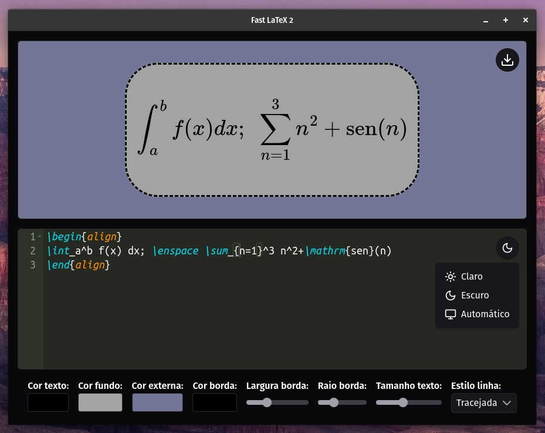

# Fast LaTeX 2

<p align="center">
  
</p>

## Demonstração

<p align="center">
  
</p>

## Introdução

O Fast LaTeX 2 é um aplicativo desktop de código aberto para renderizar equações curtas ou alinhadas em LaTeX.

Baixe o executável
[Download Fast LaTeX v2.0](https://github.com/jefersonapps/fast-latex-2/releases)

## Como executar em ambiente de desenvolvimento

- Instale o node js.
- Configure o pnpm como gerenciador de pacotes: https://pnpm.io/installation
- Rode na pasta raíz do projeto no terminal `pnpm install`, em seguida, rode `pnpm start`

## Como usar

1. Instale o app e execute-o.
2. Digite no editor de código LaTeX uma equação curta ou alinhada.
3. Ajuste as configurações de estilo.
4. Clique em "Capturar imagem" para copiar a imagem com a equação para a área de transferência.
5. Cole a imagem onde quiser.

## Como gerar um build

Para gerar um build do aplicativo, siga estas etapas:

1. Instale as dependências do projeto:

```
pnpm i
```

2. Execute o seguinte comando para gerar um build para sua plataforma atual:

```
pnpm build:linux
```

Isso gerará um build para sua plataforma atual no diretório `dist`. Você pode encontrar o executável do aplicativo no subdiretório apropriado para sua plataforma.

## Contribuindo

O Fast LaTeX 2 é um projeto de código aberto e contribuições são bem-vindas. Você pode contribuir relatando problemas, sugerindo recursos ou enviando solicitações de pull no repositório.

## Licença

O Fast LaTeX 2 é licenciado sob a licença MIT.
